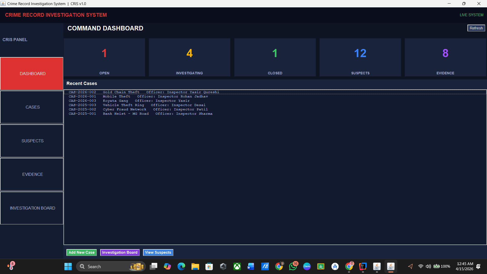
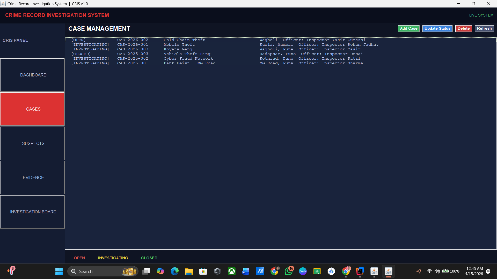
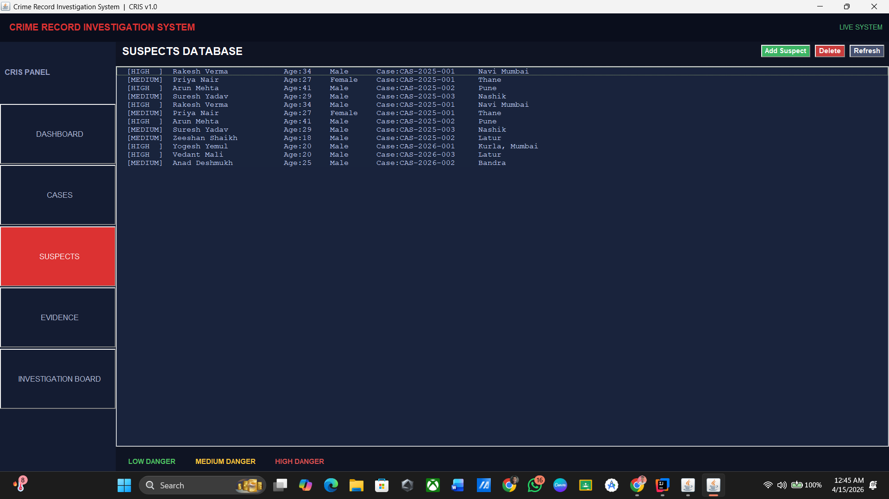
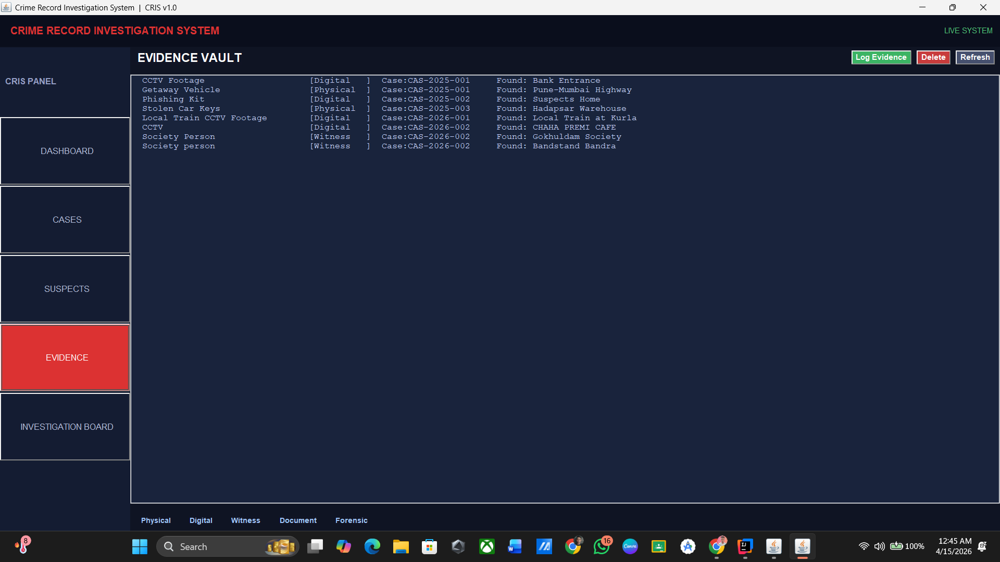
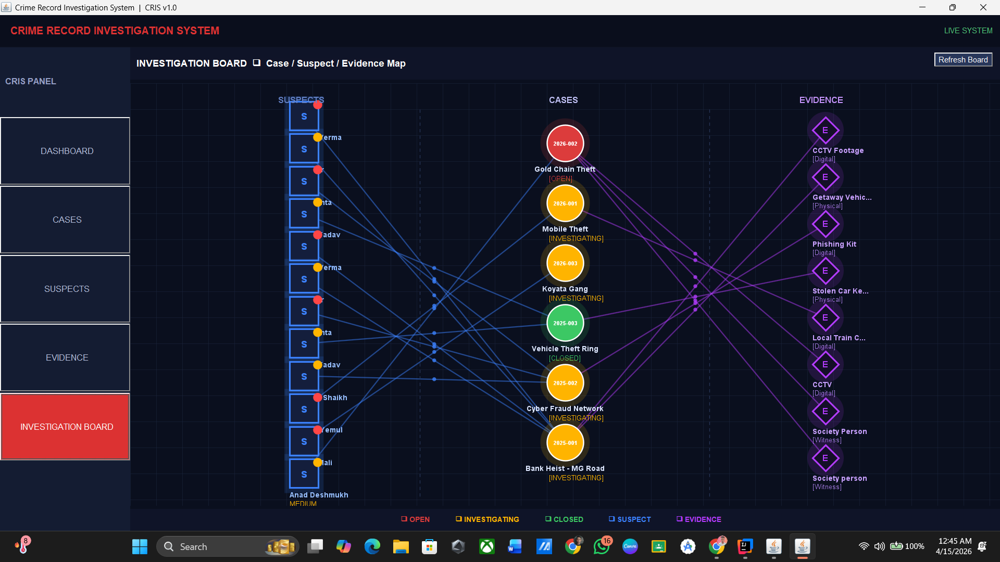

<!-- HEADER BANNER -->
<div align="center">

```
 ██████╗ ██████╗ ██╗███████╗
██╔════╝██╔══██╗██║██╔════╝
██║        ██████╔╝██║███████╗
██║        ██╔══██╗██║╚════██║
╚██████╗██║   ██║██║███████║
 ╚═════╝╚═╝   ╚═╝╚═╝╚══════╝
```

# 🔍 Crime Record Investigation System

**`CRIS v1.0`** — *Where Data Meets Justice*

[](https://java.com)
[](https://mysql.com)
[](https://docs.oracle.com/javase/8/docs/technotes/guides/swing/)
[](https://docs.oracle.com/javase/tutorial/jdbc/)
[](LICENSE)
[](https://github.com/iamyasirqureshi/Crime-Investigation-System)

<br/>

> *"The truth is out there. CRIS helps you find it — digitally, efficiently, ruthlessly."*

<br/>

---

</div>

## 📡 Overview

**CRIS** is a full-stack desktop application engineered to digitize and streamline criminal investigation workflows. Built on a clean **3-layer architecture** — Presentation → Business Logic → Data — it replaces paper-based chaos with a live, queryable, visually rich investigation command center.

No bloat. No ambiguity. Just structured, fast, reliable data management for law enforcement operations.

---

## 🧠 Architecture at a Glance

```
┌─────────────────────────────────────────────────────────┐
│               PRESENTATION LAYER (Java Swing)           │
│  MainFrame ─── CardLayout navigation across panels      │
│  Dashboard · Cases · Suspects · Evidence · Inv. Board   │
└──────────────────────┬──────────────────────────────────┘
                       │  AWT Event Listeners
                       ▼
┌─────────────────────────────────────────────────────────┐
│              BUSINESS / DAO LAYER                       │
│  CaseDAO  ·  SuspectDAO  ·  EvidenceDAO                 │
│  PreparedStatement · ResultSet · CRUD ops               │
└──────────────────────┬──────────────────────────────────┘
                       │  JDBC via DBConnection
                       ▼
┌─────────────────────────────────────────────────────────┐
│             DATABASE LAYER (MySQL 8.x — crime_db)       │
│  tables: cases · suspects · evidence                    │
│  FK relationships · ENUM types · PK AUTO_INCREMENT      │
└─────────────────────────────────────────────────────────┘
```

---

## ⚙️ Tech Stack

| Layer | Technology | Purpose |
|---|---|---|
| **UI** | Java Swing + AWT | Desktop GUI, panels, dialogs, canvas |
| **Events** | ActionListener, MouseMotion, WindowAdapter | User interaction handling |
| **Data Access** | DAO Pattern | Decoupled DB operations |
| **Connectivity** | JDBC (DriverManager + PreparedStatement) | SQL ↔ Java bridge |
| **Database** | MySQL 8.x | Persistent relational storage |
| **Models** | POJO Classes | Clean data encapsulation |
| **IDE** | IntelliJ IDEA | Development environment |

---

## 🗂️ Project Structure

```
CrimeInvestigationSystem/
│
└── src/
    └── com/
        └── crime/
            │
            ├── 📄 Main.java                    ← Entry point
            │
            ├── 📁 db/
            │   └── DBConnection.java            ← JDBC singleton connector
            │
            ├── 📁 model/                        ← POJO Data Models
            │   ├── Case.java
            │   ├── Suspect.java
            │   └── Evidence.java
            │
            ├── 📁 dao/                          ← Data Access Objects
            │   ├── CaseDAO.java
            │   ├── SuspectDAO.java
            │   └── EvidenceDAO.java
            │
            └── 📁 ui/                           ← Swing UI Components
                ├── MainFrame.java               ← Root JFrame + CardLayout
                ├── DashboardPanel.java          ← Stats & live counts
                ├── CasesPanel.java              ← Case CRUD
                ├── SuspectsPanel.java           ← Suspect management
                ├── EvidencePanel.java           ← Evidence vault
                └── InvestigationBoard.java      ← AWT Canvas visual graph
```

---

## 📸 Screenshots

> A visual walkthrough of CRIS in action.

### 🖥️ Dashboard


### 📁 Case Management


### 🕵️ Suspects Database


### 🔎 Evidence Vault


### 🗺️ Investigation Board


---

---

## 🧩 Modules & Features

### 🖥️ Command Dashboard
- Live counters: **Open · Investigating · Closed** cases
- Real-time suspect & evidence totals
- Recent cases feed with officer assignment
- Quick-action buttons for navigation

### 📁 Case Management
- Full CRUD: Add, Update Status, Delete cases
- Filter view: Open / Investigating / Closed
- Case numbering system (`CAB-YYYY-XXX`)
- Officer assignment & location tagging

### 🕵️ Suspects Database
- Danger level tagging: `LOW` · `MEDIUM` · `HIGH`
- Full profile: name, age, gender, address, background
- Direct FK link to associated case
- Color-coded table rows by danger level

### 🔎 Evidence Vault
- Type classification: `Physical` · `Digital` · `Witness` · `Document` · `Forensic`
- Found location & date logging
- Case linkage via foreign key
- Log Evidence dialog with live validation

### 🗺️ Investigation Board *(Signature Feature)*
- **AWT Canvas** — rendered visual graph
- Interactive node mapping: Cases ↔ Suspects ↔ Evidence
- Hover tooltips on nodes
- Color-coded by status (`OPEN`, `INVESTIGATING`, `CLOSED`)
- Real-time refresh from DB

---

## 🛢️ Database Schema

```sql
-- CASES
CREATE TABLE cases (
  case_id       INT AUTO_INCREMENT PRIMARY KEY,
  case_number   VARCHAR(20) UNIQUE NOT NULL,
  title         VARCHAR(100),
  status        ENUM('OPEN','INVESTIGATING','CLOSED'),
  location      VARCHAR(100),
  date_reported DATE,
  officer_name  VARCHAR(100)
);

-- SUSPECTS
CREATE TABLE suspects (
  suspect_id   INT AUTO_INCREMENT PRIMARY KEY,
  name         VARCHAR(100),
  age          INT,
  gender       ENUM('Male','Female','Other'),
  address      VARCHAR(200),
  background   TEXT,
  danger_level ENUM('LOW','MEDIUM','HIGH'),
  case_id      INT,
  FOREIGN KEY (case_id) REFERENCES cases(case_id)
);

-- EVIDENCE
CREATE TABLE evidence (
  evidence_id    INT AUTO_INCREMENT PRIMARY KEY,
  title          VARCHAR(100),
  type           ENUM('Physical','Digital','Witness','Document','Forensic'),
  description    TEXT,
  found_location VARCHAR(200),
  date           DATE,
  case_id        INT,
  FOREIGN KEY (case_id) REFERENCES cases(case_id)
);
```

---

## 🚀 Getting Started

### Prerequisites

```bash
✅ Java JDK 17+
✅ MySQL 8.x
✅ IntelliJ IDEA (recommended)
✅ MySQL Connector/J (JDBC Driver)
```

### Setup

**1. Clone the repository**
```bash
git clone https://github.com/iamyasirqureshi/Crime-Investigation-System.git
cd Crime-Investigation-System
```

**2. Setup the database**
```sql
CREATE DATABASE crime_db;
USE crime_db;
-- Run the schema SQL above
```

**3. Configure DBConnection.java**
```java
private static final String URL      = "jdbc:mysql://localhost:3306/crime_db";
private static final String USER     = "root";
private static final String PASSWORD = "your_password";
```

**4. Add MySQL Connector JAR**
> IntelliJ: `File → Project Structure → Modules → Dependencies → + JAR`
> Add `mysql-connector-j-x.x.x.jar`

**5. Run**
```bash
# Via IntelliJ: Right-click Main.java → Run
# Via terminal (Windows):
javac -cp .;mysql-connector.jar com/crime/Main.java
java  -cp .;mysql-connector.jar com.crime.Main

# Via terminal (Mac/Linux):
javac -cp .:mysql-connector.jar com/crime/Main.java
java  -cp .:mysql-connector.jar com.crime.Main
```

---

## 🔬 Request Flow

```
User Action (UI Click)
        │
        ▼
ActionListener (Event Layer)
        │
        ▼
DAO Method (e.g. CaseDAO.addCase())
        │
        ▼
DBConnection.getConnection()
        │
        ▼
PreparedStatement → SQL Execution
        │
        ▼
ResultSet → Model Object (Case / Suspect / Evidence)
        │
        ▼
UI Refresh (JTable / Canvas repaint)
```

---

## 📐 Design Principles Applied

- **DAO Pattern** — Clean separation between UI and DB logic
- **Singleton DB Connection** — Single managed JDBC connection via static class
- **POJO Models** — Pure data transport objects with getters/setters
- **CardLayout Navigation** — Single-window SPA-like panel switching
- **PreparedStatement** — SQL injection prevention + query performance
- **ENUM Types** — Controlled vocabulary for status, danger level, evidence type

---

## 🛣️ Roadmap

- [ ] 🔐 Login & role-based authentication
- [ ] 📊 Charts & analytics (JFreeChart integration)
- [ ] 📤 Export case reports as PDF
- [ ] 🔔 Case status change alerts
- [ ] 🌐 Web version — Spring Boot + React
- [ ] 📱 Mobile companion app

---

## 👨‍💻 Author

<div align="center">

**Yasir Qureshi**
`SCOD18 · Computer Engineering`
`Java Programming — 23UCOPCP2406`

[](https://github.com/iamyasirqureshi)
[](https://yasirqureshi.dev)

</div>

---

## 📄 License

```
MIT License — use it, fork it, build on it.
Give credit where it's due.
```

---

<div align="center">

**⭐ Star this repo if CRIS helped or inspired you.**

*Built with ☕ Java, 🔍 curiosity, and a relentless drive to make things work.*

```
"Every great investigation starts with organized data."
                                        — CRIS v1.0
```

</div>
